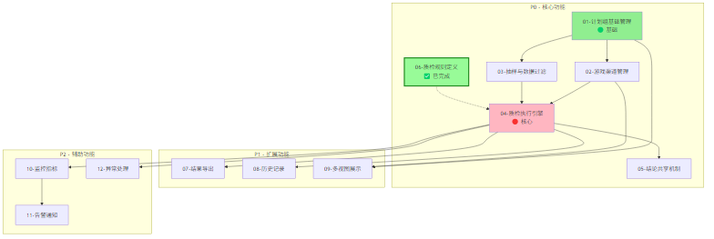
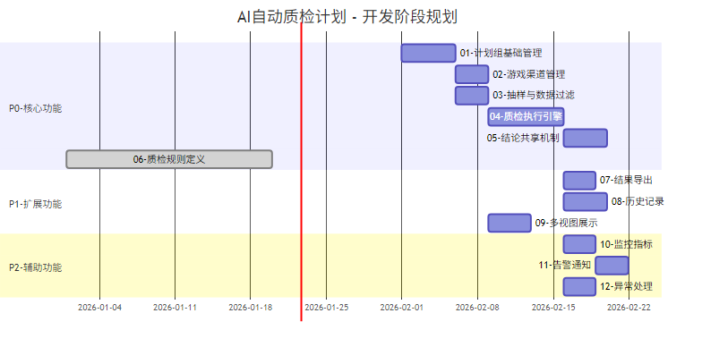
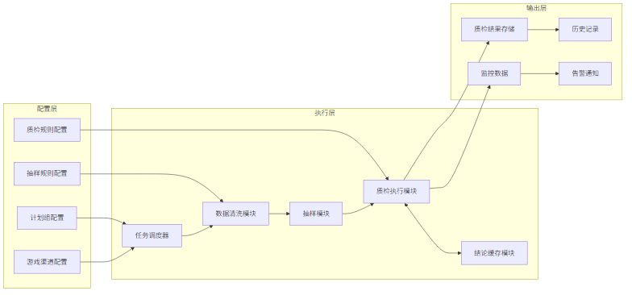
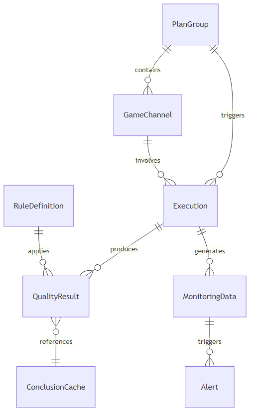

# AI自动质检计划 - 需求总集

> **文档版本**：v1.0  
> **创建时间**：2026-01-21  
> **Demo链接**：https://lollipop307013.github.io/ai-quality-inspection-platform/

---

## 一、需求概述

本项目旨在构建一个平台化的AI自动质检系统，支持产品/运营人员自主配置质检计划、数据过滤规则、执行周期等，实现全流程产品/运营可参与的质检管理平台。

### 1.1 核心目标

| 目标 | 说明 |
|------|------|
| 平台质检配置完善 | 支持产品/运营人员配置质检计划、数据过滤规则、执行周期等 |
| 运维保障 | 通过监控和企微告警机制，确保质检任务的稳定运行 |
| 多维度管理 | 支持按计划组、游戏、渠道等多维度查看和管理质检任务 |

### 1.2 子需求清单

| 编号 | 子需求名称 | 优先级 | 状态 | 文档链接 |
|------|-----------|--------|------|----------|
| 01 | 计划组基础管理 | P0 | 待开发 | [查看](./P0-核心功能/01-计划组基础管理.md) |
| 02 | 游戏渠道管理 | P0 | 待开发 | [查看](./P0-核心功能/02-游戏渠道管理.md) |
| 03 | 抽样与数据过滤 | P0 | 待开发 | [查看](./P0-核心功能/03-抽样与数据过滤.md) |
| 04 | 质检执行引擎 | P0 | 待开发 | [查看](./P0-核心功能/04-质检执行引擎.md) |
| 05 | 结论共享机制 | P0 | 待开发 | [查看](./P0-核心功能/05-结论共享机制.md) |
| 06 | 质检规则定义 | P0 | **已完成** | [查看](./P0-核心功能/06-质检规则定义.md) |
| 07 | 结果导出 | P1 | 待开发 | [查看](./P1-扩展功能/07-结果导出.md) |
| 08 | 历史记录 | P1 | 待开发 | [查看](./P1-扩展功能/08-历史记录.md) |
| 09 | 多视图展示 | P1 | 待开发 | [查看](./P1-扩展功能/09-多视图展示.md) |
| 10 | 监控指标 | P2 | 待开发 | [查看](./P2-辅助功能/10-监控指标.md) |
| 11 | 告警通知 | P2 | 待开发 | [查看](./P2-辅助功能/11-告警通知.md) |
| 12 | 异常处理 | P2 | 待开发 | [查看](./P2-辅助功能/12-异常处理.md) |

---

## 二、优先级说明

### 2.1 优先级定义

| 优先级 | 定义 | 包含子需求 |
|--------|------|-----------|
| **P0** | 核心功能，系统运行必需 | 01~06（计划组管理、游戏渠道、抽样过滤、执行引擎、结论共享、规则定义） |
| **P1** | 扩展功能，提升使用体验 | 07~09（结果导出、历史记录、多视图） |
| **P2** | 辅助功能，增强运维能力 | 10~12（监控指标、告警通知、异常处理） |

### 2.2 推荐开发顺序

```
阶段一（P0核心）：01 → 02 → 03 → 04 → 05 → 06
阶段二（P1扩展）：07 → 08 → 09
阶段三（P2辅助）：10 → 11 → 12
```

> **说明**：06-质检规则定义已在Demo中实现，可作为起点验证。

---

## 三、依赖关系矩阵

### 3.1 依赖关系表

| 子需求 | 前置依赖 | 被依赖项 |
|--------|----------|----------|
| 01-计划组基础管理 | 无 | 02、03、09 |
| 02-游戏渠道管理 | 01 | 04 |
| 03-抽样与数据过滤 | 01 | 04 |
| 04-质检执行引擎 | 02、03 | 05、07、08、10、12 |
| 05-结论共享机制 | 04 | 无 |
| 06-质检规则定义 | 无（独立） | 04 |
| 07-结果导出 | 04 | 无 |
| 08-历史记录 | 04 | 无 |
| 09-多视图展示 | 01、02 | 无 |
| 10-监控指标 | 04 | 11 |
| 11-告警通知 | 10 | 无 |
| 12-异常处理 | 04 | 无 |

### 3.2 关键路径

```
计划组基础管理 → 游戏渠道管理 → 质检执行引擎 → 结论共享机制
                              ↓
                       抽样与数据过滤
```

---

## 四、需求关联流程图

### 4.1 功能依赖关系图



### 4.2 开发阶段规划图



### 4.3 数据流向图



---

## 五、接口依赖关系

### 5.1 核心API清单

| 模块 | API端点 | 方法 | 依赖模块 |
|------|---------|------|----------|
| 计划组管理 | `/api/plan-groups` | CRUD | 无 |
| 游戏渠道 | `/api/plan-groups/{id}/channels` | CRUD | 计划组管理 |
| 执行控制 | `/api/executions` | POST/GET | 计划组、游戏渠道、抽样规则 |
| 结论缓存 | `/api/cache/conclusions` | GET | 执行控制、质检规则 |
| 结果导出 | `/api/exports` | POST | 执行控制 |
| 监控告警 | `/api/monitoring` | GET/POST | 执行控制 |

### 5.2 数据模型依赖



---

## 六、风险与注意事项

### 6.1 技术风险

| 风险项 | 影响 | 缓解措施 |
|--------|------|----------|
| 质检执行引擎复杂度高 | 开发周期延长 | 分阶段交付，先实现基础执行能力 |
| 结论缓存一致性 | 数据准确性问题 | 设计完善的缓存失效策略 |
| 大数据量导出性能 | 系统响应变慢 | 采用异步导出 + 分批处理 |

### 6.2 业务风险

| 风险项 | 影响 | 缓解措施 |
|--------|------|----------|
| 质检规则版本变更频繁 | 缓存频繁失效 | 版本管理 + 增量更新策略 |
| 监控告警过于敏感 | 告警疲劳 | 支持告警阈值自定义配置 |

---

## 七、更新记录

| 版本 | 日期 | 更新内容 | 作者 |
|------|------|----------|------|
| v1.0 | 2026-01-21 | 初始版本，完成12个子需求拆分 | yzhinan |

---

## 八、附录

### 8.1 术语表

| 术语 | 说明 |
|------|------|
| 计划组 | 批量管理多个游戏+渠道质检任务的配置单元 |
| 质检结论共享 | 相同规则版本+游戏渠道+数据ID的质检结果可复用 |
| 抽样 | 从符合条件的数据中选取指定数量进行质检 |
| 数据清洗 | 根据过滤规则剔除无效数据 |

### 8.2 相关文档

- [原始需求文档](./自动质检计划功能需求文档.md)
- [Demo演示地址](https://lollipop307013.github.io/ai-quality-inspection-platform/)
